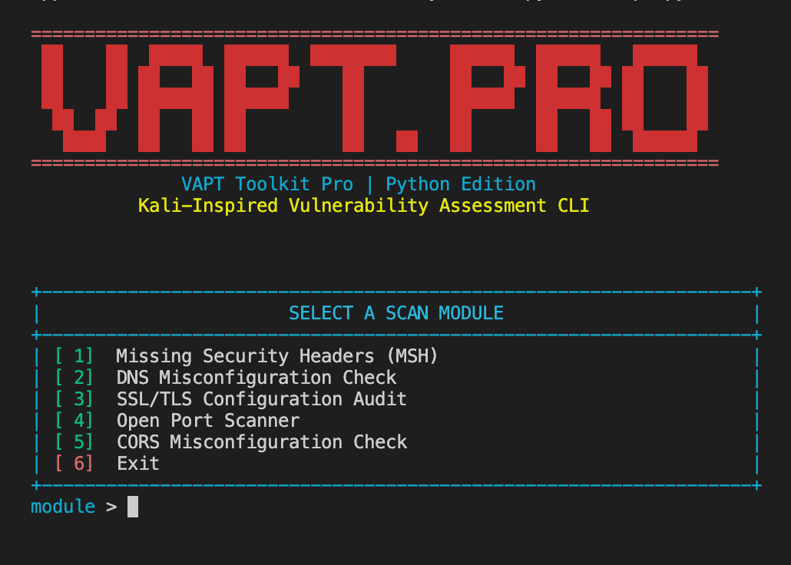

# NIKHIL AI (Python Edition)

NIKHIL AI is a menu-driven terminal toolkit for fast, practical web and network security checks.
It is built for security testers who want strong scan visibility directly in one CLI workflow.

## Highlights

- Kali-style CLI layout with clean module navigation.
- Modular scanner architecture inside `nikhil_ai_modules/`.
- Enhanced raw evidence output for HTTP and CORS checks.
- Lightweight but improved port and TLS analysis.
- Graceful operator controls (`clear`, `exit`, `Ctrl+C`).

## Included Modules

1. HTTP Security Headers Check (MSH)
2. DNS Misconfiguration Check (Origin Exposure)
3. SSL/TLS Configuration Audit
4. Open Port Scanner
5. CORS Misconfiguration Check
6. Exit

## Module Details

### 1) HTTP Security Headers Check

- Shows raw HTTP response status and all discovered response headers first.
- Runs "Analyzing HTTP headers" progress bar.
- Checks required security headers:
  - `Content-Security-Policy`
  - `Strict-Transport-Security`
  - `X-Frame-Options`
  - `X-Content-Type-Options`
  - `Referrer-Policy`
- Performs strength review for:
  - CSP (unsafe directives/wildcards/missing baseline)
  - HSTS (`max-age`, `includeSubDomains`, `preload`)

### 2) DNS Misconfiguration Check

- Resolves the target domain to IP.
- Validates whether resolved IP is public.
- Tests direct public-IP website visibility.
- Flags potential issue when direct public-IP access is reachable/visible (for your origin exposure use case).

### 3) SSL/TLS Configuration Audit

- Native SSL snapshot:
  - Negotiated TLS version and cipher
  - Certificate issuer/subject/validity
  - Certificate expiry window alerts
- Native protocol probe:
  - Checks support for TLSv1.0, TLSv1.1, TLSv1.2, TLSv1.3
  - Warns on legacy protocol exposure
- Optional external deep scans (if installed):
  - `nmap --script ssl-enum-ciphers,ssl-cert -p 443 <domain>`
  - `sslyze --regular <domain>:443`

### 4) Open Port Scanner

- Fast threaded scan over curated common TCP ports.
- Displays target and resolved IP.
- Nmap-like result table layout:
  - `PORT`, `STATE`, `SERVICE`, `DETAILS`
- Lightweight service enumeration with protocol-aware hints:
  - Banner hints (FTP/SSH/SMTP/POP3/IMAP)
  - HTTP probe hints
  - HTTPS/TLS probe hints

### 5) CORS Misconfiguration Check

- Uses malicious test origin domain format (`evil.com`) by default.
- Ensures `Origin` header is injected/replaced for testing.
- Prints:
  - `Raw Request`
  - `Raw Response`
- Analyzes CORS behavior and flags:
  - `200 OK` + `Access-Control-Allow-Origin: *`
  - `200 OK` + reflected/accepted test origin
  - Risky credential behavior with permissive origin rules

## Operator Controls

At main menu prompt:

- Type `clear` to clear terminal screen and redraw menu.
- Type `exit` in any case format (`exit`, `Exit`, `eXiT`) to quit.
- Press `Ctrl+C` to exit gracefully.
- Arrow-key escape input is guarded to avoid junk menu actions.

## Project Structure

```text
NIKHIL-AI (Python)
├── nikhil_toolkit.py
├── install_deps.py
├── requirements.txt
├── nikhil_ai_modules/
│   ├── __init__.py
│   ├── banner.py
│   ├── cors_check.py
│   ├── dns_check.py
│   ├── headers.py
│   ├── output.py
│   ├── port_scan.py
│   └── ssl_check.py
├── LICENSE
└── README.md
```

## Installation

### Prerequisites

- Python 3.8+
- `pip`

### Install

```bash
git clone https://github.com/YOUR_USERNAME/NIKHIL-AI-Python.git
cd "NIKHIL-AI-Python"
python3 install_deps.py
```

This installer is cross-platform and force-reinstalls dependencies, so users do not get stuck with partial/old environments.
It also checks optional tooling (`nmap`, `sslyze`) used by the SSL/TLS module.

Manual fallback:

```bash
python3 -m pip install --upgrade --force-reinstall -r requirements.txt
```

## Usage

```bash
python3 nikhil_toolkit.py
```

Then select module number `1` to `6`.

## Tool Preview



## Notes on Optional SSL Tooling

Module 3 auto-detects external tools:

- If `nmap` is present, SSL scripts are executed.
- If `sslyze` is present, regular SSLyze scan is executed.
- If missing, scan continues with native Python checks only.

## Disclaimer

Use this tool only on systems you own or are explicitly authorized to test.
Unauthorized scanning is illegal and may violate applicable laws.

## License

MIT License. See `LICENSE`.
