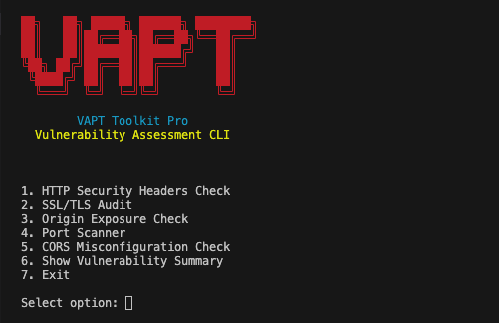

# 🛡️ VAPT Toolkit Pro (Python Edition)

A professional, menu-driven **VAPT (Vulnerability Assessment and Penetration Testing)** toolkit written in **Python**.  
This tool is designed for **security researchers, penetration testers, bug bounty hunters, and system administrators** to quickly perform automated security checks directly from the terminal.

The Python version improves upon the Bash toolkit by adding **colorized output, threaded scanning, modular architecture, and improved cross-platform compatibility.**

---

## 🚀 Key Features

- **Unified CLI Interface**  
  One command to launch a menu-driven security toolkit with a clean ASCII banner.

- **Modular Architecture**  
  Each scanner runs as an independent module inside `vapt_modules/`.

- **Colorized Terminal Output**  
  Professional CLI output similar to Kali Linux tools.

- **Threaded Scanning**  
  Fast multi-threaded port scanning for improved performance.

- **Cross Platform Support**  
  Works on **Linux, macOS, and Windows**.

- **Security-Focused Design**  
  Includes basic input validation to prevent misuse and reduce SSRF risks.

- **Automated Vulnerability Summary**  
  Displays a consolidated list of detected issues after scans.

---

## 🛠️ Included Modules

| Module | Description |
|------|-------------|
| **1. HTTP Security Headers Check** | Detects missing HTTP security headers (CSP, HSTS, XFO, Referrer-Policy, etc.) |
| **2. SSL/TLS Audit** | Validates certificate details and TLS configuration |
| **3. Origin Exposure Check** | Checks DNS origin exposure for potential CDN/WAF bypass |
| **4. Port Scanner** | Multi-threaded scanner for common open ports |
| **5. CORS Misconfiguration Check** | Detects CORS misconfigurations such as wildcard or reflected origins |
| **6. Vulnerability Summary** | Generates a summary of all detected security issues |

*(More modules are coming soon!)*

---

## 📂 Project Structure

```text
VAPT-Toolkit-Pro (Python)
│
├── vapt.py                   # Main entry point and menu
├── vapt_modules/             # Scanner modules directory
│   ├── banner.py             # Displays ASCII banner
│   ├── cors_check.py         # CORS misconfiguration check logic
│   ├── dns_check.py          # Origin exposure check logic
│   ├── headers.py            # HTTP security headers check logic
│   ├── output.py             # Output formatting and color utilities
│   ├── port_scan.py          # Port scanner implementation
│   ├── ssl_check.py          # SSL/TLS auditing logic
│   └── vapt_summary.py       # Vulnerability summary generator
│
├── LICENSE                   # MIT License
└── README.md                 # Project Documentation
```

---

## 📥 Installation

### 1️⃣ Prerequisites

Ensure you have the following installed on your system:
- Python 3.8+
- `pip` (Python package manager)

### 2️⃣ Clone the Repository

```bash
git clone https://github.com/YOUR_USERNAME/VAPT-Toolkit-Pro-Python.git
cd "VAPT-Toolkit-Pro-Python"
```
*(Make sure to adjust the folder name to match your cloned repository's name if it differs.)*

### 3️⃣ Install Dependencies

Install the required external libraries (`requests` and `colorama`) by running:

```bash
pip install requests colorama
```

*(If a `requirements.txt` file is present, you can alternately run `pip install -r requirements.txt`)*

---

## ▶️ Usage

To launch the toolkit's interactive menu, simply execute the main script:

```bash
python3 vapt.py
```



Provide target URLs, domains, or IP addresses as prompted by individual modules. The toolkit will run the relevant security checks and display its findings.

### Example Menu Options:
1. `HTTP Security Headers Check` - Enter a target URL (e.g., `example.com`).
2. `SSL/TLS Audit` - Enter a target domain name.
3. `Origin Exposure Check` - Enter a target domain name.
4. `Port Scanner` - Enter a target host/IP.
5. `CORS Misconfiguration Check` - Enter a target URL.
6. `Show Vulnerability Summary` - View the combined findings of all executed scans.
7. `Exit` - Close the toolkit.

---

## ⚡ Future Improvements

Planned features for upcoming versions:
- Automated full scan mode (run all modules sequentially)
- Technology fingerprinting and stack detection

---

## 📄 License

This project is licensed under the MIT License. See the `LICENSE` file for details.

---

## ⚠️ Disclaimer

- This tool is intended strictly for **educational purposes and authorized security testing only.**
- Running security scans against systems, networks, or applications without explicit permission is illegal and may violate local or international laws.
- The developers assume **no liability** and are not responsible for any misuse, damage, or legal consequences caused by executing this program. Use responsibly.
 